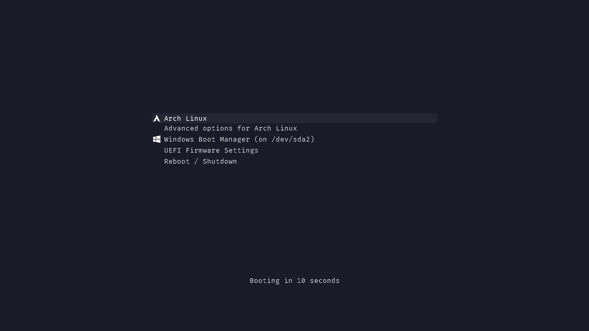

<h1 align="center">
  
</h1>

<h4 align="center">
  GRUB2 Theme Vimix Very Dark Blue
</h4>

<p align="center">
  <a href="docs/CONTRIBUTING.md">
    
  </a>

  <a href="http://commitizen.github.io/cz-cli/">
    
  </a>

  <a href="https://badgen.net/github/stars/trueNAHO/grub2-theme-vimix-very-dark-blue?cache=0">
    
  </a>

  <a href="https://badgen.net/github/watchers/trueNAHO/grub2-theme-vimix-very-dark-blue?cache=0">
    
  </a>

  <a href="https://badgen.net/github/contributors/trueNAHO/grub2-theme-vimix-very-dark-blue?cache=0">
    
  </a>

  <a href="https://badgen.net/github/branches/trueNAHO/grub2-theme-vimix-very-dark-blue?cache=0">
    
  </a>

  <a href="https://badgen.net/github/last-commit/trueNAHO/grub2-theme-vimix-very-dark-blue/master?cache=0">
    
  </a>

  <a href="https://badgen.net/github/checks/trueNAHO/grub2-theme-vimix-very-dark-blue?cache=0">
    
  </a>

  <a href="https://badgen.net/github/status/trueNAHO/grub2-theme-vimix-very-dark-blue?cache=0">
    
  </a>

  <a href="docs/CODE_OF_CONDUCT.md">
    
  </a>

  <a href="LICENSE">
    
  </a>
</p>

<p align="center">
  <a href="#how-to-use">How to use</a> •
  <a href="#related">Related</a> •
  <a href="#contrbuting">Contributing</a> •
  <a href="#license">License</a>
</p>

# How to use

## Installation

### AUR

Install the [AUR
package](https://aur.archlinux.org/packages/grub-theme-vimix-very-dark-blue):

```shell
yay -S grub-theme-vimix-very-dark-blue
```
### git

Install this repository inside a temporary directory using `git`:

```bash
(
  declare -r current_dir="$PWD" \
      && declare -r tmp_dir="$(mktemp -d)" \
      && cd "$tmp_dir" \
      && git clone https://github.com/trueNAHO/grub2-theme-vimix-very-dark-blue.git \
      && cd grub2-theme-vimix-very-dark-blue \
      && makepkg -si \
      && cd "$current_dir" \
      && rm -fr "$tmp_dir"
)
```

## Setup

### Arch Linux

Edit `/etc/default/grub`:

```shell
GRUB_THEME="/usr/share/grub/themes/grub-theme-vimix-very-dark-blue/theme.txt"
```

Update GRUB:

```shell
grub-mkconfig -o /boot/grub/grub.cfg
```

### Fedora 28/29/32

Edit `/etc/default/grub`:

```shell
GRUB_THEME="/usr/share/grub/themes/grub-theme-vimix-very-dark-blue/theme.txt"
```

Update GRUB:

```shell
sudo grub2-mkconfig -o /etc/grub2.cfg
```

Update GRUB for UEFI boot:

```shell
sudo grub2-mkconfig -o /etc/grub2-efi.cfg
```

# Related

- [Commitizen](http://commitizen.github.io/cz-cli/) - Simple commit conventions
  for internet citizens
- [GNU GRUB](https://www.gnu.org/software/grub/) - A Multiboot boot loader
- [GRUB2 Theme Vimix](https://github.com/Se7endAY/grub2-theme-vimix) - A blur
  theme for GRUB
- [pre-commit](https://pre-commit.com/) - A framework for managing and
  maintaining multi-language pre-commit hooks

# Contributing

Please read [CONTRIBUTING.md](docs/CONTRIBUTING.md) for details on contributing.

# License

This project is licensed under [GNU GENERAL PUBLIC LICENSE Version 3](LICENSE).
